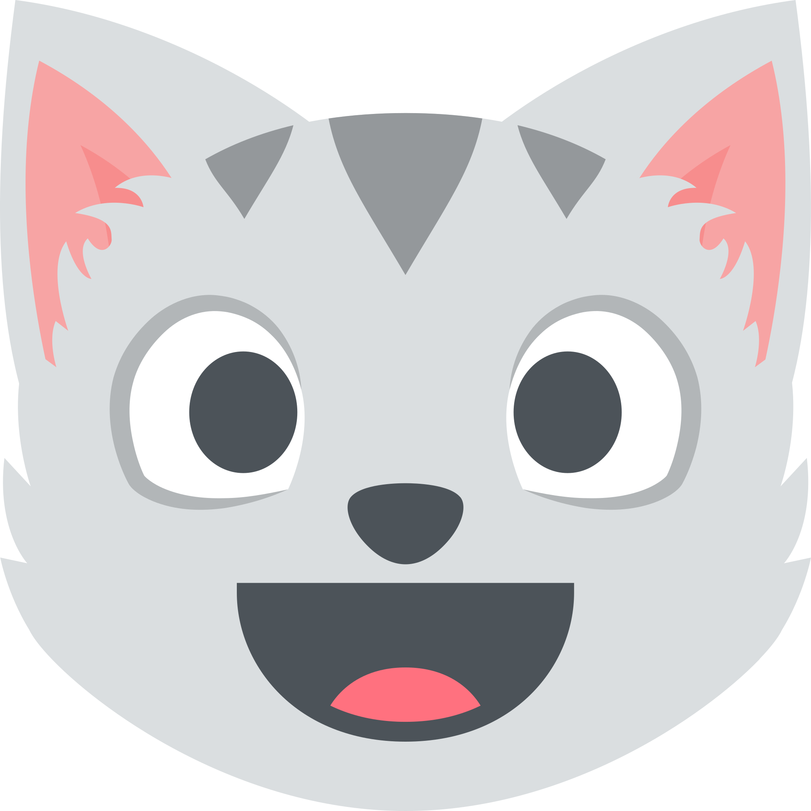
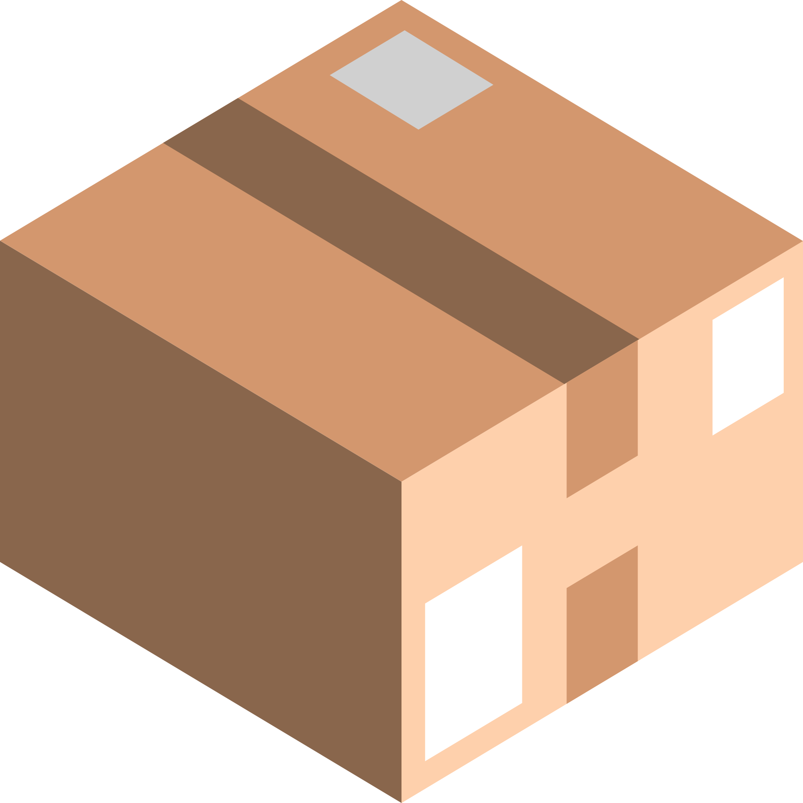
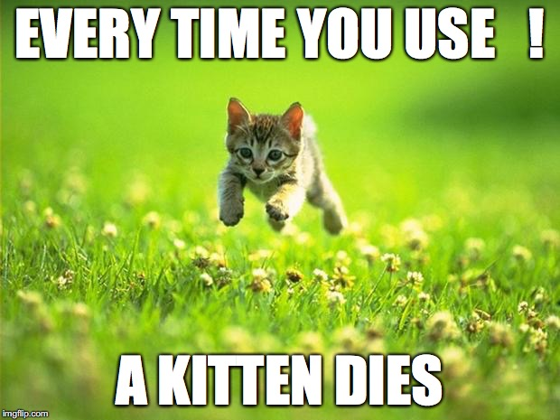

# CocoaHeads CPS

## *Francesco Perrotti-Garcia*

---

#[fit] `Optional`s 

# e o

#[fit] **Gato de Schrödinger**

---


#[fit] *Francesco* 
#[fit] *Perrotti-Garcia*
#[fit] iOS Developer
#[fit] **_@fpg1503_**

---


---


---


---


---


---


--- 


---


---


---

#[fit] *Optionals*

---

#[fit] *Gato de Scrödinger*

---

#[fit] O que é?

^ "a cat imagined as being enclosed in a box with a radioactive source and a poison that will be released when the source (unpredictably) emits radiation, the cat being considered (according to quantum mechanics) to be simultaneously both dead and alive until the box is opened and the cat observed."


---

#[fit] Dois estados

---

# Vivo


---

# Morto


---

#[fit] Incerteza do conteúdo da caixa

---



---

#[fit] Como saber?

---

#[fit] Abrindo!

---

#[fit] Legal, gatos...

#[fit] Mas e os `Optional`s?

---

#[fit] `Optional`s 
#[fit] são uma **caixa**

---

#[fit] Dois estados

---

#[fit] Alguma coisa

---

#[fit] Nada

---

#[fit] É um tipo!

---

```swift
enum MyOptional {
    case Some
    case None
}

let nothing = MyOptional.None
let something = MyOptional.Some
```

---

#[fit] Enums com valor associado

---

```swift
enum MyOptional {
    case Some(Any)
    case None
}

let something = MyOptional.Some(3)
```

---

#[fit] `something.dynamicType`
#[fit] `MyOptional.Type`

---

#[fit] Genéricos

---

```swift
enum MyOptional<T> {
    case Some(T)
    case None
}

let something = MyOptional.Some(3)
```

---

#[fit] `something.dynamicType`
#[fit] `MyOptional<Int>.Type`

---

#[fit] `let nothing = MyOptional.None`
#[fit]  **Generic parameter '**`T`**' could not be inferred**

---

#[fit] `let nothing = MyOptional<Int>.None`

---

#[fit] `MeuTipo?`
#[fit] na verdade é
#[fit] `Optional<MeuTipo>`

---

# Açúcar Sintático!

---

#[fit] Criando


---

#[fit] Criar um `Optional`
#[fit] *`None`*

---

#[fit] `Optional<Int>()`

---

#[fit] `Optional<Cat>()`

---

#[fit] `MyOptional<Cat>()`

---

#[fit] *error:* '`MyOptional<Cat>`'
#[fit] cannot be constructed
#[fit] because it has no accessible initializers

---

```swift
init() {
	self = .None
}
```

---

#[fit] Criar um `Optional`
#[fit] *`Some`*

---

#[fit] `let cat = Cat()`

---

#[fit] `let mrWhiskers = MyOptional<Cat>(cat)`

---

#[fit] *error:* argument passed to 
#[fit] call that takes no arguments

---

```swift
init(_ some: T) {
    self = .Some(some)
}
```

---

#[fit] Desembrulhando

---

#[fit] `switch`

---

```swift
switch mrWhiskers {
case .Some(let cat):
    cat.meow()
case .None:
    print("No cat")
}
```

---

#[fit] Patern Matching

---

```swift
if case let .Some(cat) = mrWhiskers {
    cat.meow()
}
```

---

#[fit] `nil` é uma caixa vazia

---

#[fit] *`LiteralConvertible`s*

---

## Coisas que podem ser
## criadas a partir de um
#[fit] *literal*

---

#[fit] *NSHipster*

---

#[fit] **@mattt**

---

#[fit] Swift Literal
#[fit] **Convertibles**

---

#[fit] **`swift/docs/Literals.rst`**

---

#[fit] 10 protocolos

---

#[fit] *`FloatLiteralConvertible`*
#[fit] **`3.14159`**
^ Double, Float, Float80

---

#[fit] *`IntegerLiteralConvertible`*
#[fit] **`299792458`**
^ SignedNumberType -> AbsoluteValuable -> Double, Float, Float80
^ SignedIntegerType: Int, Int8, Int16, Int32, Int64
^ UnsignedIntegerType: UInt, UInt8, UInt 16, UInt32, UInt64

---

#[fit] *`BooleanLiteralConvertible`*
#[fit] __`true` ou `false`__
^ Bool

---

#[fit] *`ArrayLiteralConvertible`*
#[fit] **`["🐮", "🐔", "🐑", "🐶", "🐱"]`**

---

#[fit] *`Set`*

---

#[fit] `let animals: Set =`
#[fit] `["🐮", "🐔", "🐑", "🐶", "🐱"]`
^ OptionSetType, ArraySlice, ContiguousArray

---

#[fit] *`DictionaryLiteralConvertible`*
#[fit] **`["YYZ": "Toronto Pearson", "DUB": "Dublin",`**
#[fit] **`"VCP": "Viracopos", "SFO": "San Francisco"]`**

---

#[fit] *`UnicodeScalarLiteralConvertible`*
#[fit] *`ExtendedGraphemeClusterLiteralConvertible`*
#[fit] *`StringLiteralConvertible`*
#[fit] `"Hello, CocoaHeads CPS!"`


^ String, procolos em ordem da herança

---

#[fit] *`StringInterpolationConvertible`*
#[fit] `"Meu gato é o \(cat.name)"`

^ String

---

#[fit] *`NilLiteralConvertible`*

---

#[fit] Pode ser criado com um `nil` literal
^ Optional, ImplicltlyUnwrappedOptional
^ UnsafePointer, UnsafeMutablePointer, AutoReleasingUnsafeMutablePointer, COpaquePointer

---

```swift
extension MyOptional: NilLiteralConvertible {
    init(nilLiteral: ()) {
        self = .None
    }
}
```

---

#[fit] `Optional`s são contêineres

---

#[fit] `map`
#[fit] `flatMap`

---

#[fit] `map`

---

```swift
func map<U>(f: (T -> U)) -> MyOptional<U> {
    guard let value = self else {
        return .None
    }
    let mappedValue = f(value)
    return .Some(mappedValue)
}
```

---

#[fit] E se `f`
#[fit] `throws`?

---

```swift
func map<U>(f: (T throws -> U)) rethrows -> MyOptional<U> {
    guard let value = self else {
        return .None
    }
    let mappedValue = try f(value)
    return .Some(mappedValue)
}
```

---

#[fit] **Não** deve ser usado pelo 
#[fit] *efeito colateral*

---

#[fit] `@warn_unused_result`

---

```swift
@warn_unused_result
func map<U>(f: (T throws -> U)) rethrows -> MyOptional<U> {
    guard let value = self else {
        return .None
    }
    let mappedValue = try f(value)
    return .Some(mappedValue)
}
```

---

#[fit] `flatMap`

---

#[fit] Mapeia e
#[fit] achata

---

```swift
@warn_unused_result
func flatMap<U>(f: (T throws -> MyOptional<U>)) rethrows -> MyOptional<U> {
    guard let value = self else {
        return .None
    }
    let mappedValue = try f(value)
    return mappedValue
}
```

---

#[fit] O que **não**
#[fit] conseguimos recriar?

---

#[fit] Açúcar sintático

---

#[fit] `if let`

---

#[fit] Caso deve ser `.Some`

---

```swift
if let cat = mrWhiskers {
    cat.meow()
}
```

---

#[fit] Inicilaizadores
#[fit] Falíveis

---

#[fit] `NSURL`

---


---

#[fit] `init?(string: String)`
^ public convenience init?(string URLString: String)

---

```swift
init?(name: String) {
    guard name == "Mozzie" else {
        return .None
    }
    self = Cat()
}
```

---

#[fit] `nil` is the only return value permitted in an initializer

---

```swift
init?(name: String) {
    guard name == "Mozzie" else {
        return nil
    }
    self = Cat()
}
```

---

#[fit] `let myCat = Cat(name: "Miau")`

---

#[fit] `myCat.dynamicType`
#[fit] `Optional<Cat>`

---

#[fit] Não são inicializadores
#[fit] do seu tipo!

---

#[fit] Boas
#[fit] práticas 

---

#[fit] Piramyd of
#[fit] **doom**

---

```swift
var a: String? = "one"
var b: String? = "two"
var c: String? = "three"
```

---

```swift
if let aUnwrapped = a {
  if let bUnwrapped = b {
    if let cUnwrapped = c {
      println("\(aUnwrapped) - \(bUnwrapped) - \(cUnwrapped)")
    }
  }
}
```

---

```swift
if let aUnwrapped = a, bUnwrapped = b, cUnwrapped = c {
  println("\(aUnwrapped) - \(bUnwrapped) - \(cUnwrapped)")
}
```

---

```swift
if let aUnwrapped = a,
    bUnwrapped = b,
    cUnwrapped = c {
      println("\(aUnwrapped) - \(bUnwrapped) - \(cUnwrapped)")
}
```

---

#[fit] `self?.collectionView?.indexPathsForSelectedItems()!`

---


---

#[fit] `ImplicitlyUnwrappedOptionals`

---

#[fit] O irmão malvado do optional

---


---

#[fit] Também é um
#[fit] `Optional`

---

#[fit] Objective-C

---

#[fit] `IBOutlet`

---

#[fit] Trocar nos Outlets

---

#[fit] `@IBOutlet weak var tableView: UITableView!`

---

#[fit] `@IBOutlet weak var tableView: UITableView?`

---

#[fit] Usar como `Optional`!

---

#[fit] `tableView?.reloadData()`

---

#[fit] Também funciona com
#[fit] coisas do `ObjC`!

---



---

#[fit] `EXC_BREAKPOINT`

---

#[fit] `line: 0`

---

#[fit] Ponte com
#[fit] `Objective-C`

---

#[fit] Opcionalidade 
#[fit] !=
#[fit] Nulabilidade

---

#[fit] `Optional`
#[fit] é um tipo!

---

#[fit] Type-safety do
#[fit] que pode não existir

---

#[fit] Mais segurança!

---

#[fit] `nil`
#[fit] é um valor!

---

#[fit] Mandar mesagens para `nil`
#[fit] retorna `nil`

---

#[fit] `null pointer exception`

---

#[fit] `nil`

---

#[fit] __Fatal error:__ unexpectedly found `nil`
#[fit] while unwrapping an `Optional` value

---

#[fit] `Optional`s
#[fit] são como caixas

---

#[fit] Você não sabe o que tem dentro

---

#[fit] Force unwrap
#[fit] Desembrulhar forçado

---

#[fit] Ir contra `type-safety`
---

#[fit] Implementações "de verdade"

---

```swift
public enum Optional<Wrapped> : _Reflectable, NilLiteralConvertible {
    case None
    case Some(Wrapped)
    /// Construct a `nil` instance.
    public init()
    /// Construct a non-`nil` instance that stores `some`.
    public init(_ some: Wrapped)
    /// If `self == nil`, returns `nil`.  Otherwise, returns `f(self!)`.
    @warn_unused_result
    public func map<U>(@noescape f: (Wrapped) throws -> U) rethrows -> U?
    /// Returns `nil` if `self` is nil, `f(self!)` otherwise.
    @warn_unused_result
    public func flatMap<U>(@noescape f: (Wrapped) throws -> U?) rethrows -> U?
    /// Create an instance initialized with `nil`.
    public init(nilLiteral: ())
}

extension Optional : CustomDebugStringConvertible {
    /// A textual representation of `self`, suitable for debugging.
    public var debugDescription: String { get }
}
```

---

```swift
/// Construct a `nil` instance.
@_transparent
public init() { self = .None }
```

---

```swift
/// Construct a non-`nil` instance that stores `some`.
@_transparent
public init(_ some: Wrapped) { self = .Some(some) }
```

---

```swift
/// Create an instance initialized with `nil`.
@_transparent
public init(nilLiteral: ()) {
	self = .None
}
```

---

```swift
/// If `self == nil`, returns `nil`.  Otherwise, returns `f(self!)`.
@warn_unused_result
public func map<U>(@noescape f: (Wrapped) throws -> U) rethrows -> U? {
	switch self {
	case .Some(let y):
		return .Some(try f(y))
	case .None:
		return .None
	}
}
```

---

```swift
/// Returns `nil` if `self` is `nil`, `f(self!)` otherwise.
@warn_unused_result
	public func flatMap<U>(@noescape f: (Wrapped) throws -> U?) rethrows -> U? {
	switch self {
	case .Some(let y):
		return try f(y)
	case .None:
		return .None
	}
}
```

---

#[fit] Nil coalescing

---

```swift
@_transparent
@warn_unused_result
public func ?? <T> (optional: T?, @autoclosure defaultValue: () throws -> T)
    rethrows -> T {
  switch optional {
  case .Some(let value):
    return value
  case .None:
    return try defaultValue()
  }
}
```

---

#[fit] O que é 
#[fit] `@_transparent`?

---

#[fit] **`swift/docs/TransparentAttr.rst`**

---

#[fit] Obrigado!

--- 

#[fit] **Dúvidas?**

---

#[fit] License

- My Code: [MIT](https://opensource.org/licenses/MIT)
- Apple's Code: [Apache](http://swift.org/LICENSE.txt)
- Deckset: [CC-BY-SA](https://creativecommons.org/licenses/by-sa/4.0/legalcode)
- Emoji art: supplied by [Emoji One](http://emojione.com/)

---

#[fit] Contato:
#[fit] *@fpg1503*
